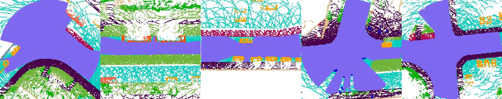
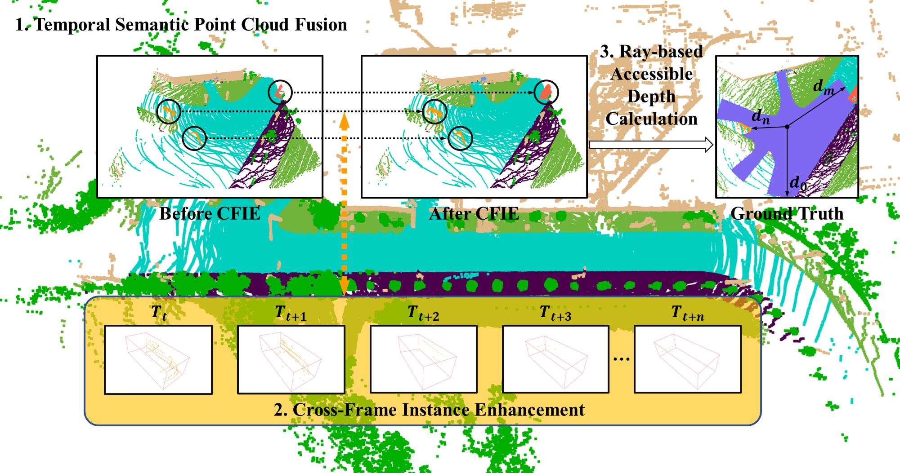

# Building nuScenes-CAD dataset

nuScenes is a widely-adopted, large-scale open-source dataset specifically designed for autonomous driving research. It provides multi-view camera images, LiDAR point clouds, and comprehensive annotations, making it an excellent benchmark for surround-view perception tasks such as Bird's-Eye-View (BEV) semantic segmentation and semantic occupancy prediction. Although the original nuScenes dataset does not include direct annotations for **Circular Accessible Depth (CAD)**, its rich metadata—including 3D bounding boxes, semantic point clouds, sensor calibrations, and ego-vehicle poses—enables the automated generation of high-quality ground-truth labels for this tasks. To this end, we introduce **nuScenes-CAD**, a derived dataset built directly on top of the original nuScenes data. In this section, we first describe the annotation generation pipeline for nuScenes-CAD, followed by details on its file structure and usage instructions.

## Contents
1. [Circular Accessible Depth](#circular-accessible-depth)
2. [Automated Generation Pipeline](#automated-generation-pipeline)   
2.1 [Temporal Semantic Point Cloud Fusion](#temporal-semantic-point-cloud-fusion)   
2.2 [Cross-Frame Instance Enhancement](#cross-frame-instance-enhancement)   
2.3 [Ray-based Accessible Depth Calculation](#ray-based-accessible-depth-calculation)   
3. [How to use](#how-to-use)
4. [Reference](#reference)

## Circular Accessible Depth
CAD represents traversable space as a set of maximum accessible depths in all radial directions centered on the ego vehicle. Unlike pixel-wise BEV semantic segmentation maps based on Cartesian coordinates, CAD adopts a polar coordinate representation that more intuitively and efficiently encodes the distance to the traversable area boundary.

<figure>
  
</figure>

## Automated Generation Pipeline
The nuScenes-CAD dataset organizes data by scenes, with each scene lasting approximately 20 seconds. Within each scene, keyframes (samples) and their associated multi-view images and point clouds are annotated at 2 Hz (yielding ~40 annotated samples per scene). Our automated labeling pipeline leverages these rich annotations to generate CAD labels for key samples in each scene. Each CAD label consists of $L=384$ accessible depths radiating from the ego vehicle in all directions around it. The automated generation process comprises three key steps: (1) Temporal Semantic Point Cloud Fusion, (2) Cross-Frame Instance Enhancement, and (3) Ray-Based Accessible Depth Calculation. Specifically, it first constructs a dense semantic point cloud map for each scene, then derives spatial semantic representations for samples by traversing the timeline, and finally computes the CAD labels based on these representations.

<figure>
  
</figure>

### Temporal Semantic Point Cloud Fusion
We first construct a dense point cloud map for each scene using the LiDAR segmentation annotations. For a scene with N samples, let $P_i \in \mathbb{R}^4$ denote the semantic point cloud of the i-th sample, where $P_i = \{(x_j, y_j, z_j, cls_j) \mid j=1,\dots,M\}$. Each point includes position $(x,y,z)$ and semantic class $cls$ from nuScenes LiDARSeg.
Since $P_i$ is in LiDAR coordinates, we transform it to the global map frame using the associated sensor calibration $Tf^{lidar \to ego}$ and ego pose $Tf^{ego \to map}$:
$$P_i^{map} = Tf^{ego \to map} \cdot Tf^{lidar \to ego} \cdot P_i^{lidar}$$
To avoid trailing artifacts from moving objects during temporal fusion, we filter out dynamic classes (e.g., pedestrians, vehicles) based on semantics, retaining only static points:
$$map = \textbf{Static}(P_1^{map}, \dots, P_N^{map})$$
### Cross-Frame Instance Enhancement

### Ray-based Accessible Depth Calculation

## How to use

## Reference